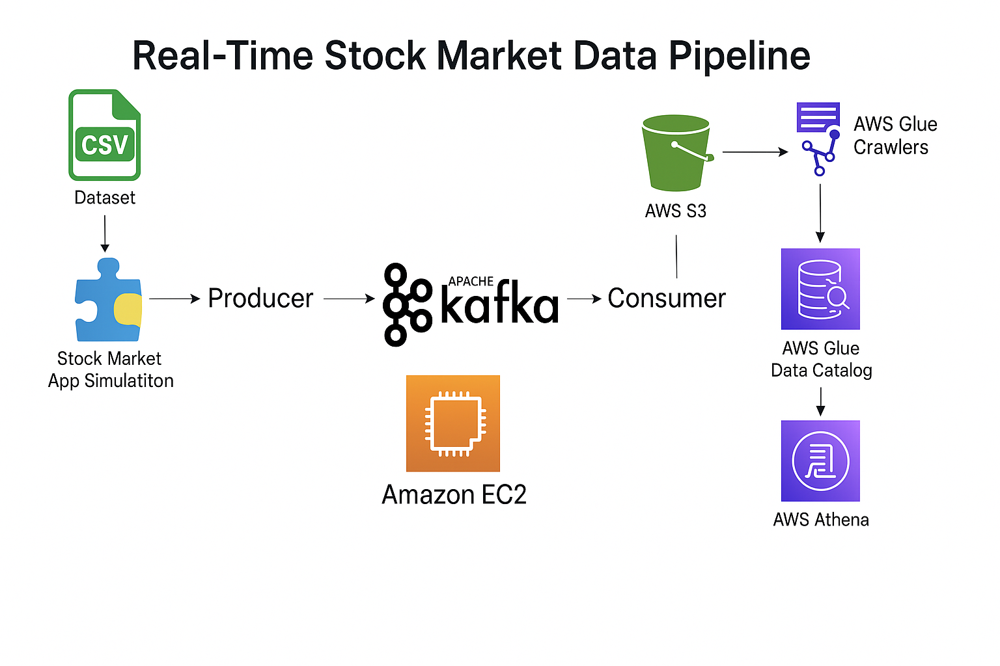

# Real-Time Stock Market Data Pipeline

## Introduction
This project implements a real-time data pipeline to collect, process, and analyze stock market data using a combination of Python, Apache Kafka, and AWS services such as EC2, S3, Glue, and Athena. The goal of this pipeline is to ingest live stock market data, perform transformations, and enable real-time querying and analysis. It provides a scalable architecture that supports both raw and processed data storage, along with efficient data querying for insights.

## Key Objectives:
**Data Ingestion**: Capture live stock market data streams using Kafka.
**Data Storage**: Store the incoming data in AWS S3 for both raw and processed states.
**Data Transformation**: Use AWS Glue to clean and prepare the data for analysis.
**Data Analysis**: Query and analyze the transformed data using AWS Athena for real-time insights into stock performance.
This project demonstrates the integration of various modern technologies to build an end-to-end, scalable, and efficient real-time data solution.

## Architecture Diagram


## Technology Used
1. **Python**: Core programming language for data processing.
2. **Apache Kafka**: Real-time streaming and messaging platform.
3. **AWS EC2**: Scalable virtual servers for running and managing Kafka clusters in a distributed environment.
4. **AWS S3**: Scalable object storage for storing raw and processed data.
5. **AWS Glue**: ETL service for data transformation and cataloging.
6. **AWS Athena**: Serverless query service for data analysis.


## Dataset Used
Using stock market data that is randomly selected from the stockmarket_data.csv file.

## ▶️ How to Use

1. **Set up Kafka and EC2**:
   - Deploy Kafka broker on an EC2 instance.
   - Update security group to allow port 9092.

2. **Configure Environment Variables**:
   Create a `.env` file or export environment variables for:
   - `KAFKA_BROKER` (e.g., `localhost:9092`)
   - `S3_BUCKET_NAME` (e.g., `my-stock-data-pipeline`)

3. **Run Kafka Producer**:
   ```bash
   python KafkaProducer.py
   ```

4. **Run Kafka Consumer**:
   ```bash
   python KafkaConsumer.py
   ```

5. **Optional**: Use the Jupyter notebooks to visualize and test streaming and transformation steps.

---

## 📜 License

This project is licensed under the MIT License. See [LICENSE](LICENSE) for details.

